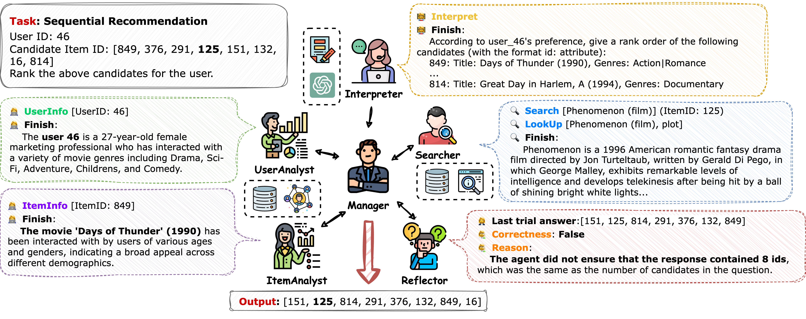

# Multi-Agent Recommendation System

## Overview

This project implements a recommendation system based on multi-agent architecture, where multiple agents collaborate to perform various recommendation tasks.



## Directory Structure

### Main Directory

- **`macrec/`**: Main source directory
  - **`agents/`**: Agent classes
    - `analyst.py`: Data analysis agent
    - `base.py`: Base class for agents
    - `interpreter.py`: Task interpretation agent
    - `manager.py`: Manager agent
    - `reflector.py`: Reflection and improvement agent
    - `searcher.py`: Information search agent
  
  - **`dataset/`**: Data processing and preprocessing
  
  - **`evaluation/`**: System performance evaluation
    - Ranking metrics
    - Rating metrics
  
  - **`llms/`**: Wrapper for Large Language Models (LLMs)
  
  - **`systems/`**: Multi-agent systems
    - `base.py`: Base system class
    - `collaboration.py`: **Collaboration system (recommended)**
    - `analyse.py`, `chat.py`, `react.py`, `reflection.py`: Other systems (deprecated)
  
  - **`tasks/`**: Task execution
    - `base.py`: Base task class
    - `calculate.py`: Metric calculation
    - `chat.py`: Chat interaction with system
    - **`evaluate.py`**: Evaluation on rating prediction or sequence recommendation tasks
    - `generation.py`: Generate answers from dataset
    - **`pure_generation.py`**: Generate answers without evaluation
    - `preprocess.py`: Dataset preprocessing
    - `test.py`: Evaluation on few-shot samples
  
  - **`utils/`**: Utility functions

### Configuration Directory

- **`config/`**: Configuration files
  - `api-config.json`: API configuration for LLMs
  - `agents/`: Configuration for each agent
  - `prompts/`: Prompt templates
    - `agent_prompt/`: Prompts for agents
    - `data_prompt/`: Input data preparation prompts
    - `manager_prompt/`: Prompts for Manager agent
  - `systems/`: Configuration for each system
  - `tools/`: Tool configurations

### Data and Results Directory

- **`data/`**: Raw and processed data
- **`log/`**: Log files
- **`run/`**: Evaluation results
- **`scripts/`**: Utility scripts

## Environment Setup

### System Requirements
- Python >= 3.10.13

### Installation Steps

1. **Install PyTorch** (change URL if using different CUDA version):
   ```bash
   pip install torch --extra-index-url https://download.pytorch.org/whl/cu118
   ```

2. **Install dependencies**:
   ```bash
   pip install -r requirements.txt
   ```

3. **Download and preprocess datasets** (Amazon Beauty):
   ```bash
   python main.py --main Preprocess --data_dir data/Beauty --dataset amazon --n_neg_items 7
   ```

## Usage Guide

### Running from Command Line

**General syntax:**
```bash
python main.py -m $task_name --verbose $verbose $extra_args
```

This command runs the `${task_name}Task` defined in `macrec/tasks/*.py`.

**Example:** Evaluate sequence recommendation on Amazon Beauty dataset with Collaboration system (including Reflector, Analyst, and Searcher):
```bash
python main.py --main Evaluate \
  --data_file data/Beauty/test.csv \
  --system collaboration \
  --system_config config/systems/collaboration/reflect_analyse_search.json \
  --task sr
```

Refer to sample scripts in the `scripts/` directory for more examples.

### Running Web Interface

1. **Start web demo:**
   ```bash
   streamlit run web_demo.py
   ```

2. **Access the application:**
   Open your browser and navigate to `http://localhost:8501/`

**Note:** Systems using open-source LLMs may require significant memory. These systems will be disabled on machines without CUDA support.

## Notes

- Sample API configuration file: `api-config-example.json`
- Systems marked as *deprecated* in the `systems/` directory are no longer actively developed
- Recommended to use `CollaborationSystem` for most tasks

---

**Project Report** - Multi-Agent Architecture Recommendation System